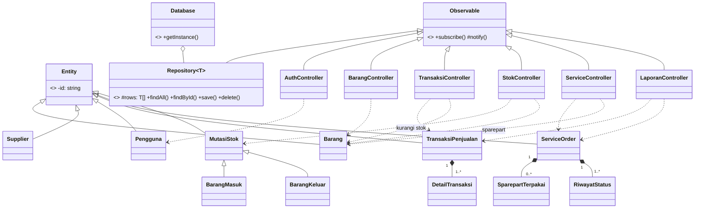

# Arsitektur OOP — Sistem Manajemen Toko & Service "Denka Computer"

Dokumen ini menjelaskan arsitektur berorientasi objek (OOP) aplikasi, mengikuti
pembagian tiga macam kelas pada tugas: **boundary class**, **controller class**,
dan **entity class**. Bahasa implementasi: **TypeScript** (React + Vite) —
alternatif dari rekomendasi Java/PHP, dengan prinsip OOP yang sama.

## 1. Struktur Paket

```
src/
├── domain/                    ← lapisan OOP (bebas dari React)
│   ├── core/                  ← kelas dasar
│   │   ├── Entity.ts          ← abstract class Entity
│   │   ├── Observable.ts      ← abstract class Observable (pola Observer)
│   │   └── Repository.ts      ← abstract class Repository<T> (generik)
│   ├── entities/              ← ENTITY CLASS
│   │   ├── Barang.ts
│   │   ├── Supplier.ts
│   │   ├── Pengguna.ts
│   │   ├── TransaksiPenjualan.ts   (+ DetailTransaksi)
│   │   ├── ServiceOrder.ts         (+ SparepartTerpakai, RiwayatStatus)
│   │   └── MutasiStok.ts           (abstrak; + BarangMasuk, BarangKeluar)
│   ├── repositories/          ← simulasi tabel database (in-memory)
│   │   ├── BarangRepository.ts
│   │   ├── SupplierRepository.ts
│   │   ├── PenggunaRepository.ts
│   │   ├── TransaksiRepository.ts
│   │   ├── ServiceRepository.ts
│   │   └── MutasiStokRepository.ts
│   ├── controllers/           ← CONTROLLER CLASS
│   │   ├── AuthController.ts
│   │   ├── BarangController.ts
│   │   ├── SupplierController.ts
│   │   ├── PenggunaController.ts
│   │   ├── TransaksiController.ts
│   │   ├── StokController.ts
│   │   ├── ServiceController.ts
│   │   └── LaporanController.ts
│   └── Database.ts            ← Singleton pemegang semua repository
└── app/
    ├── hooks/use-controller.ts  ← jembatan Observer → React
    └── components/               ← BOUNDARY CLASS (komponen React)
        ├── login.tsx, topbar.tsx, app-sidebar.tsx
        ├── dashboard.tsx, pos.tsx, data-barang.tsx, stok-barang.tsx
        ├── service.tsx, laporan.tsx, data-supplier.tsx
        └── manajemen-pengguna.tsx
```

## 2. Pemetaan Boundary — Controller — Entity

| Boundary (React) | Controller | Entity yang terlibat |
|---|---|---|
| `login.tsx` | `AuthController` | `Pengguna` |
| `topbar.tsx` | `AuthController`, `LaporanController` | `Pengguna`, `Barang`, `ServiceOrder` |
| `dashboard.tsx` | `LaporanController` | `TransaksiPenjualan`, `ServiceOrder`, `Barang` |
| `pos.tsx` | `TransaksiController` | `TransaksiPenjualan`, `DetailTransaksi`, `Barang` |
| `data-barang.tsx` | `BarangController` | `Barang`, `Supplier` |
| `stok-barang.tsx` | `StokController` | `MutasiStok` (`BarangMasuk`/`BarangKeluar`), `Barang`, `Supplier` |
| `service.tsx` | `ServiceController` | `ServiceOrder`, `SparepartTerpakai`, `RiwayatStatus`, `Barang` |
| `laporan.tsx` | `LaporanController` | `TransaksiPenjualan`, `MutasiStok`, `ServiceOrder`, `Barang` |
| `data-supplier.tsx` | `SupplierController` | `Supplier` |
| `manajemen-pengguna.tsx` | `PenggunaController`, `AuthController` | `Pengguna` |

Aturan alur: **boundary tidak pernah menyentuh entity/repository langsung** —
semua permintaan (validasi, simpan, hitung) lewat controller.

## 3. Entity Class (atribut & metode utama)

### `Barang`
- Atribut (private): `_kode`, `_nama`, `_kategori`, `_hargaBeli`, `_hargaJual`, `_stok`, `_stokMinimum`, `_supplier`, `_spesifikasi`
- Metode: `statusStok(): aman|menipis|habis`, `margin()`, `stokCukup(n)`, `tambahStok(n)`, `kurangiStok(n)` *(melempar error bila stok kurang)*, `perbarui(data)`

### `Supplier`
- Atribut: `_nama`, `_kontakPerson`, `_telepon`, `_alamat`, `_catatan`, `_barangDisuplai[]`
- Metode: `jumlahBarang()`, `tambahBarangDisuplai(nama)`, `perbarui(data)`, `cocok(kataKunci)`

### `Pengguna`
- Atribut: `_nama`, `_username`, `_email`, `_password` *(private, tidak pernah dibaca boundary)*, `_role`, `_aktif`, `_terakhirLogin`
- Metode: `cekPassword(pw)`, `cocokIdentitas(usernameAtauEmail)`, `catatLogin()`, `setAktif(b)`, `inisial()`, `perbarui(data)`

### `TransaksiPenjualan` + `DetailTransaksi`
- Atribut: `_nomor`, `_tanggal`, `_kasir`, `_items[]`, `_tipeDiskon`, `_nilaiDiskon`, `_metode`, `_uangDiterima`
- Metode: `subtotal()`, `diskon()`, `total()`, `kembalian()`, `jumlahItem()`, `keuntungan()`
- `DetailTransaksi` menyimpan **snapshot** harga jual & harga beli saat transaksi, sehingga laporan tetap akurat walau harga barang berubah.

### `ServiceOrder` + `SparepartTerpakai` + `RiwayatStatus`
- Atribut: `_nomor`, `_pelanggan`, `_telepon`, `_jenisUnit`, `_merk`, `_keluhan`, `_diagnosa`, `_teknisi`, `_prioritas`, `_status`, `_tanggalMasuk`, `_biayaJasa`, `_sparepart[]`, `_riwayat[]`
- Metode: `ubahStatus(s)` *(otomatis mencatat riwayat)*, `totalBiaya()`, `tanggalSelesai()`, `sudahSelesai()`, `tambahSparepart(...)`, `hapusSparepart(id)`, `toggleKelengkapan(nama)`

### `MutasiStok` (abstrak) → `BarangMasuk`, `BarangKeluar`
- Contoh **inheritance & polimorfisme**: atribut umum (`_tanggal`, `_namaBarang`, `_jumlah`, `_dicatatOleh`, `_catatan`) di kelas induk; `BarangMasuk` menambah `_supplier`, `_hargaSatuan`, `_noFaktur`, `totalBiaya()`; `BarangKeluar` menambah `_alasan`. Properti abstrak `jenis` diimplementasikan berbeda oleh tiap subclass.

## 4. Controller Class (logika bisnis)

Semua controller memakai pola **Singleton** (`getInstance()`) dan mewarisi
`Observable` (pola **Observer**) sehingga boundary otomatis dirender ulang
saat data berubah (lewat hook `useController`).

| Controller | Tanggung jawab utama |
|---|---|
| `AuthController` | `login()`, `logout()`, sesi pengguna aktif, role efektif; menolak akun nonaktif |
| `BarangController` | CRUD barang, `validasi()` (kode unik, harga jual ≥ harga beli), filter/pencarian, aksi massal |
| `TransaksiController` | Keranjang POS (`tambahKeKeranjang`, `ubahJumlah`), hitung `subtotal/diskon/total/kembalian`, `prosesPembayaran()` → membuat `TransaksiPenjualan` **dan** mengurangi stok `Barang` |
| `StokController` | `catatBarangMasuk()` (menambah stok), `catatBarangKeluar()` (validasi stok cukup) — entity mutasi & entity barang selalu konsisten |
| `ServiceController` | Alur status kanban, `buatService()`, `tambahSparepart()` (mengurangi stok inventori), `hapusSparepart()` (mengembalikan stok) |
| `SupplierController` | CRUD + validasi supplier |
| `PenggunaController` | CRUD akun; aturan: tidak boleh hapus/nonaktifkan akun sendiri, username unik |
| `LaporanController` | Read-only: KPI dashboard, tren penjualan, komposisi service, laporan penjualan/stok/terlaris/keuntungan/service — dihitung dari data asli lintas repository |

## 5. Lapisan Data — `Database`, `Repository<T>` & Persistensi

- `Repository<T extends Entity>` adalah **kelas generik abstrak** dengan operasi
  `findAll / findById / save / delete / deleteMany` — mensimulasikan tabel database.
- `Database` adalah **Singleton** yang memegang keenam repository + data awal (seed),
  sehingga POS, stok, service, dan laporan **berbagi satu sumber data**
  (menjual barang di POS langsung mengurangi stok di Data Barang dan tercermin di Laporan).
- **Persistensi (localStorage)** — kelas `PenyimpananLokal` (adapter storage browser)
  menyimpan snapshot seluruh repository secara otomatis (debounce 250 ms) setiap ada
  perubahan, lalu memuatnya kembali saat aplikasi dibuka. Tiap entity punya
  `toJSON()` / `static dariJSON()` untuk serialisasi (tanggal di-revive menjadi `Date`,
  subclass `BarangMasuk`/`BarangKeluar` direkonstruksi lewat kolom diskriminator `jenis`).
  Sesi login juga persisten ("Ingat saya" → localStorage, tanpa → sessionStorage),
  dan nomor nota/tiket diturunkan dari data tersimpan (pengganti auto-increment).
  Reset ke data contoh tersedia di **Pengaturan → Data & Cadangan**.
- Transformasi ke tabel database (poin 10 tugas): tiap entity class = satu tabel —
  `barang`, `supplier`, `pengguna`, `transaksi_penjualan` + `detail_transaksi` (1..N),
  `service_order` + `sparepart_terpakai` (1..N) + `riwayat_status` (1..N),
  `mutasi_stok` (single-table inheritance dengan kolom `jenis`).

## 6. Diagram Kelas (ringkas)



## 7. Prinsip OOP yang Diterapkan

1. **Enkapsulasi** — semua atribut entity `private` dengan getter; stok hanya bisa
   berubah lewat `tambahStok`/`kurangiStok`; password hanya lewat `cekPassword`.
2. **Pewarisan (inheritance)** — `Entity`, `Observable`, `Repository<T>` sebagai
   kelas induk; `MutasiStok → BarangMasuk/BarangKeluar`.
3. **Polimorfisme** — properti abstrak `jenis` pada `MutasiStok`; pemilahan
   subclass dengan `instanceof` di `MutasiStokRepository`.
4. **Abstraksi** — boundary hanya tahu antarmuka controller, tidak tahu cara
   data disimpan/dihitung.
5. **Pola desain** — Singleton (`Database`, semua controller), Observer
   (`Observable` + `useController`), Repository (lapisan akses data).

## 8. Akun Demo

| Login | Password | Role |
|---|---|---|
| `budi` / `budi@denkacomputer.id` | `denka123` | Pemilik |
| `sari` / `sari@denkacomputer.id` | `sari123` | Admin |
| `rizki` / `rizki@denkacomputer.id` | `rizki123` | Admin |
| `agus` | `agus123` | Admin (nonaktif — ditolak login) |

## 9. Menjalankan

```bash
pnpm install
pnpm dev        # jalankan aplikasi
pnpm typecheck  # periksa tipe TypeScript
pnpm build      # build produksi
```
